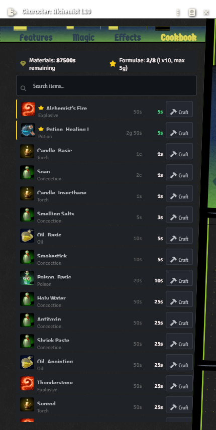

# Vagabond Character Enhancer

A Foundry VTT module that automates ancestry traits, class features, and perks for the [Vagabond](https://vagabond.game/) RPG system. Detects class features from compendium data and applies managed Active Effects for gameplay automation.

## Screenshots

| Alchemist Cookbook | Bard Virtuoso |
|:-:|:-:|
|  |  |

| Dancer Step Up | Druid Beast Form |
|:-:|:-:|
|  |  |

## Installation

### Method 1: Manifest URL (Recommended)

1. Open Foundry VTT and go to the **Add-on Modules** tab
2. Click **Install Module**
3. Paste the following URL into the **Manifest URL** field at the bottom:

```
https://github.com/DimitroffVodka/vagabond-character-enhancer/releases/latest/download/module.json
```

4. Click **Install**
5. Launch your world and enable the module under **Settings → Manage Modules**

This method will allow Foundry to automatically detect future updates.

### Method 2: Manual Download

1. Go to the [latest release](https://github.com/DimitroffVodka/vagabond-character-enhancer/releases/latest)
2. Download `module.zip`
3. Extract the zip into your Foundry VTT modules folder:
   - **Windows:** `%localappdata%/FoundryVTT/Data/modules/`
   - **macOS:** `~/Library/Application Support/FoundryVTT/Data/modules/`
   - **Linux:** `~/.local/share/FoundryVTT/Data/modules/`
4. Ensure the extracted folder is named `vagabond-character-enhancer`
5. Launch your world and enable the module under **Settings → Manage Modules**

## Compatibility

- **Foundry VTT:** v13+
- **Vagabond System:** v5.0.0+

## Optional Dependencies

- **Vagabond Crawler** — Enables NPC ability automation (Morale, abilities, etc.)

## Status Legend

| Icon | Meaning |
|------|---------|
| ✅ Module | Fully automated with hooks, Active Effects, and/or monkey-patches |
| ✅ System | Handled natively by the Vagabond system — no module code needed |
| ✅ AE | Implemented via managed Active Effects applied to the actor |
| 📝 Flavor | Registered for tracking but requires no automation (player decisions, RP rules) |
| 🔲 Todo | Planned but not yet implemented |
| 🔲 Partial | Partially implemented — some aspects still need work |

---

## Fully Implemented Classes

### Alchemist

| Feature | Level | Status | What It Does |
|---------|-------|--------|--------------|
| Alchemy | 1 | ✅ Module | Full crafting UI window with search, cost calculation, craft buttons |

Catalyze
Eureka 
Potency
Mix
Big Bang
Prima Materia


---

### Barbarian

| Feature | Level | Status | What It Does |
|---------|-------|--------|--------------|
| Rage | 1 | ✅ Module | DR per die, die upsizing, exploding dice, auto-berserk on attack/damage, combat end cleanup |
| Wrath | 1 | 📝 Flavor | Gain the Interceptor Perk. Can make its attack against Enemies that make Ranged Attacks, Cast, or damage you or an Ally. |
| Aggressor | 2 | ✅ Module | +10 Speed during first Round of Combat. 3+ Fatigue doesn't prevent Rush Action. |
| Fearmonger | 4 | ✅ Module | When you kill an Enemy, every Near Enemy with HD lower than your Level becomes Frightened until end of your next Turn. |
| Mindless Rancor | 6 | ✅ Module | Managed AE for extra rage bonuses |
| Bloodthirsty | 8 | ✅ Module | Attacks against Beings missing any HP are Favored. Sense them within Far as Blindsight. |
| Rip and Tear | 10 | ✅ Module | +1 universal damage bonus during rage |

---

### Bard

| Feature | Level | Status | What It Does |
|---------|-------|--------|--------------|
| Virtuoso | 1 | ✅ Module | Performance check → Valor/Resolve/Inspiration buff buttons on chat card, auto-applies to party |
| Well-Versed | 1 | 📝 Flavor | Ignore Prerequisites for Perks, and gain a Perk of your choice. |
| Song of Rest | 2 | ✅ Module | Auto-applies healing bonus on rest chat cards (Presence + Bard Level) |
| Starstruck | 4 | ✅ Module | Chat card integration for status application (Berserk, Charmed, Confused, or Frightened) |
| Bravado | 6 | ✅ Module | Will Saves can't be Hindered while not Incapacitated. |
| Climax | 8 | ✅ Module | Favor and bonus dice you grant can Explode (the d6 favor die explodes on max). |
| Starstruck Enhancement | 10 | ✅ Module | Starstruck can now affect all Near Enemies. |

---

### Dancer

| Feature | Level | Status | What It Does |
|---------|-------|--------|--------------|
| Fleet of Foot | 1 | ✅ Module | Managed AE: reflexCritBonus reduced by ceil(Dancer Level / 4) |
| Step Up | 1 | ✅ Module | Dialog to select allies, grants bonus action via AE |
| Evasive | 2 | ✅ Module | Ignore Hinder on Reflex Saves while not Incapacitated. Ignore two Dodged damage dice instead of one. |
| Don't Stop Me Now | 4 | 🔲 Todo | Speed unaffected by Difficult Terrain. Favor on Saves vs Paralyzed, Restrained, or being moved. |
| Choreographer | 6 | ✅ Module | Extends Step Up with Favor + Speed bonus |
| Flash of Beauty | 8 | ✅ Module | Injects "two Actions this turn" reminder into chat cards |
| Double Time | 10 | ✅ Module | Step Up can target two Allies instead of one. |

---

### Druid

| Feature | Level | Status | What It Does |
|---------|-------|--------|--------------|
| Primal Mystic | 1 | ✅ System | Casting handled by base system |
| Feral Shift | 1 | 📝 Flavor | Perk grant + action economy rule |
| Tempest Within | 2 | ✅ Module | Cold/Fire/Shock DR per die (monkey-patch on damage calc) |
| Innervate | 4 | 📝 Flavor | Action to transfer Mana to a Close Being, or end Charmed/Confused/Frightened/Sickened. |
| Ancient Growth | 6 | 📝 Flavor | Self-Polymorph Focus allows one additional Focus Spell. Beast attacks count as (+1) Relics. |
| Savagery | 8 | ✅ Module | +1 Armor managed AE, toggles active only during polymorph |
| Force of Nature | 10 | ✅ Module | Auto-rolls Awareness check on lethal damage, chat card with result |

**Polymorph System** — Beast Form tab on character sheet with 72 beasts from compendium. Dialog selection, token swap, Mysticism cast checks, Roll Damage button, condition auto-apply, and size scaling.

---

### Gunslinger

| Feature | Level | Status | What It Does |
|---------|-------|--------|--------------|
| Quick Draw | 1 | ✅ Module | Free Ranged attack before first Turn — auto-applies Hinder on 2H weapons. Flag consumed after one attack. |
| Deadeye | 1 | ✅ Module | Cascading crit threshold: each passed Ranged Check lowers crit by 1 (min 17). Tracks stacks via actor flags. Resets at end of Turn if no hit. |
| Skeet Shooter | 2 | 📝 Flavor | Once per Round, make Off-Turn Ranged attack to reduce incoming projectile damage. |
| Grit | 4 | ✅ Module | When you Crit on a Ranged attack, damage dice can explode. Accounts for Marksmanship die upsizing. |
| Devastator | 6 | ✅ Module | Reduce an Enemy to 0 HP → Deadeye crit immediately set to 17 (max stacks). |
| Bad Medicine | 8 | ✅ Module | Extra die of damage on Ranged Crit. Die size accounts for Marksmanship bonus. |
| High Noon | 10 | ✅ Module | Once per Turn, Crit on Ranged → chat notification for one additional attack. Tracks usage per turn. |

---

## Registry + Managed AE Classes

These classes have feature registries with auto-detection flags and managed Active Effects where applicable, but no runtime hooks yet.

### Fighter

| Feature | Level | Status | What's Automated |
|---------|-------|--------|------------------|
| Fighting Style | 1 | 📝 Flavor | Perk grants (manual) |
| Valor | 1/4/8 | ✅ AE | attackCritBonus + reflexCritBonus + endureCritBonus: -1/-2/-3 scaling with level |
| Momentum | 2 | ✅ Module | Pass save → next attack favored |
| Muster for Battle | 6 | 📝 Flavor | Two actions on first turn |
| Harrying | 10 | 📝 Flavor | Attack twice with Attack action |

---

### Hunter

| Feature | Level | Status | What's Automated |
|---------|-------|--------|------------------|
| Hunter's Mark | 1 | 🔲 Todo | Mark target → 2d20 keep highest |
| Survivalist | 1 | 📝 Flavor | Perk grant + narrative bonuses |
| Rover | 2 | ✅ Module | Difficult Terrain doesn't impede walking Speed. Gain Climb and Swim. |
| Overwatch | 4 | 🔲 Todo | Mark bonus extends to saves |
| Quarry | 6 | 📝 Flavor | Narrative blindsight sense |
| Lethal Precision | 8 | 🔲 Todo | 3d20 keep highest |
| Apex Predator | 10 | 🔲 Todo | Ignore immune + armor vs mark |

---

### Luminary

| Feature | Level | Status | What's Automated |
|---------|-------|--------|------------------|
| Theurgy | 1 | ✅ System | Casting handled by base system |
| Radiant Healer | 1 | 🔲 Todo | Healing dice explode on max |
| Overheal | 2 | 🔲 Todo | Excess HP redirect |
| Ever-Cure | 4 | 🔲 Todo | Healing removes a status |
| Revivify | 6 | 📝 Flavor | Narrative revival mechanic |
| Saving Grace | 8 | 🔲 Todo | Healing dice also explode on 2 |
| Life-Giver | 10 | 📝 Flavor | Modifies Revivify |

---

### Magus

| Feature | Level | Status | What's Automated |
|---------|-------|--------|------------------|
| Spellstriker | 1 | ✅ System | Casting handled by base system |
| Esoteric Eye | 1 | 📝 Flavor | Narrative magic detection |
| Spell Parry | 2 | 📝 Flavor | Defensive choice |
| Arcane Recall | 4 | 📝 Flavor | Swap spell known on rest |
| Spell Surge | 6 | 🔲 Todo | Block cast by 10+ → reflect |
| Aegis Obscura | 8 | 🔲 Todo | Allsight + half magic damage with Ward |
| Spell Surge (8+) | 10 | 🔲 Todo | Lower Spell Surge threshold |

---

### Merchant

| Feature | Level | Status | What's Automated |
|---------|-------|--------|------------------|
| Gold Sink | 1 | 🔲 Todo | Item transmutation UI |
| Deep Pockets | 1 | ✅ AE | inventory.bonusSlots = ceil(level/2), scales with level |
| Bang for Your Buck | 2 | 🔲 Todo | Luck roll to not expend items |
| Diamond Hands | 4 | 📝 Flavor | Downtime relic modification |
| Treasure Seeker | 6 | 📝 Flavor | Narrative sense |
| Bang for Your Buck (d8) | 8 | 🔲 Todo | Upgrade refund die |
| Top Shelf | 10 | 📝 Flavor | Weekly relic pull |

---

### Pugilist

| Feature | Level | Status | What's Automated |
|---------|-------|--------|------------------|
| Fisticuffs | 1 | 🔲 Partial | Brawl d4 minimum — needs verification |
| Rope-a-Dope | 1 | 📝 Flavor | Perk grant |
| Beat Rush | 2 | 📝 Flavor | Action economy |
| Prowess | 4 | 🔲 Todo | Block ignores 2 highest dice |
| Haymaker | 6 | 🔲 Todo | Pass brawl by 10+ → Dazed |
| Impact | 8 | ✅ AE | brawlDamageDieSizeBonus +2 (d4→d6) |
| Haymaker (8+) | 10 | 🔲 Todo | Lower Haymaker threshold |

---

### Revelator

| Feature | Level | Status | What's Automated |
|---------|-------|--------|------------------|
| Righteous | 1 | ✅ System | Casting handled by base system |
| Selfless | 1 | 🔲 Todo | Take damage for ally |
| Lay on Hands | 2 | 🔲 Todo | d6+level healing, 2 uses/rest |
| Paragon's Aura | 4 | ✅ AE | focus.maxBonus +1 |
| Divine Resolve | 6 | ✅ AE | statusImmunities: blinded, paralyzed, sickened |
| Holy Diver | 8 | 🔲 Todo | After Selfless → favor + Presence damage |
| Sacrosanct | 10 | ✅ AE | saves.reflex/endure/will.bonus +2 |

---

### Rogue

| Feature | Level | Status | What's Automated |
|---------|-------|--------|------------------|
| Sneak Attack | 1 | 🔲 Todo | Extra d4s on favored attacks + armor pen |
| Infiltrator | 1 | 📝 Flavor | Perk grant + narrative bonuses |
| Unflinching Luck | 2 | 🔲 Todo | Luck refund die (d12) |
| Evasive | 4 | 🔲 Todo | Ignore hinder on Reflex + extra dodge die |
| Lethal Weapon | 6 | 🔲 Todo | Sneak Attack on all favored attacks |
| Unflinching Luck (d10) | 8 | 🔲 Todo | Upgrade refund die |
| Waylay | 10 | 🔲 Todo | Kill → extra action |

---

### Sorcerer

| Feature | Level | Status | What's Automated |
|---------|-------|--------|------------------|
| Glamour | 1 | ✅ System | Casting handled by base system |
| Tap | 1 | 🔲 Todo | Reduce Max HP → regain Mana |
| Spell-Slinger | 2 | ✅ AE | castCritBonus -1 + spellDamageDieSize 8 |
| Quickening | 4 | 📝 Flavor | Skip move to cast |
| Arcane Anomaly | 6 | 🔲 Todo | Half magic damage |
| Spell Twinning | 8 | 🔲 Todo | 2nd same-spell cast favored |
| Overpowered | 10 | ✅ AE | Additional castCritBonus -1 (total crit on 18) |

---

### Vanguard

| Feature | Level | Status | What's Automated |
|---------|-------|--------|------------------|
| Stalwart | 1 | 📝 Flavor | Perk grant + Hold extension |
| Guard | 1 | 📝 Flavor | Reaction shove |
| Rampant Charge | 2 | 📝 Flavor | Push during movement |
| Wall (Large) | 4 | 🔲 Partial | AE stub — no system field for shove size |
| Unstoppable | 6 | 📝 Flavor | Chain shoves |
| Wall (Huge) | 8 | 🔲 Partial | AE stub — no system field |
| Indestructible | 10 | 🔲 Todo | Immune to attack damage with Armor ≥ 1 |

---

### Witch

| Feature | Level | Status | What's Automated |
|---------|-------|--------|------------------|
| Occultist | 1 | ✅ System | Casting handled by base system |
| Hex | 1 | 🔲 Todo | Continual spell effects without focus |
| Ritualism | 2 | 📝 Flavor | Downtime ritual |
| Things Betwixt | 4 | 🔲 Todo | Invisible until next turn |
| Coventry | 6 | 📝 Flavor | Cast allies' spells |
| Widdershins | 8 | 🔲 Todo | Hex target weak to your damage |
| Ritualism (2) | 10 | 📝 Flavor | Two rituals per shift |

---

### Wizard

| Feature | Level | Status | What's Automated |
|---------|-------|--------|------------------|
| Spellcaster | 1 | ✅ System | Casting handled by base system |
| Page Master | 1 | 🔲 Todo | Studied die on damage/healing |
| Sculpt Spell | 2 | ✅ AE | deliveryManaCostReduction +1 |
| Manifold Mind | 4 | ✅ AE | focus.maxBonus +1 |
| Extracurricular | 6 | 🔲 Todo | Studied die to cast unknown spell |
| Manifold Mind (3) | 8 | ✅ AE | Additional focus.maxBonus +1 (total +2) |
| Archwizard | 10 | ✅ AE | Additional deliveryManaCostReduction +1 |

---

## Ancestry Traits

Ancestry traits are automatically detected from compendium items on the character sheet and applied as managed Active Effects where applicable.

### Dwarf
| Trait | Status | What It Does |
|-------|--------|--------------|
| Darksight | ✅ AE | Not Blinded by Dark. |
| Sturdy | ✅ AE | Favor on Saves against Frightened, Sickened, or Shoved. |
| Tough | ✅ AE | Bonus to max HP equal to your Level. |

### Draken
| Trait | Status | What It Does |
|-------|--------|--------------|
| Breath Attack | ✅ Module | Endure or Will Save to make a 15' Cone dealing 2d6! draconic breath. Recharges on Rest or 1 Fatigue. |
| Scale | ✅ AE | +1 bonus to Armor Rating. |
| Draconic Resilience | ✅ AE | Half damage from a chosen source: Acid, Cold, Fire, or Shock. |

### Elf
| Trait | Status | What It Does |
|-------|--------|--------------|
| Ascendancy | 📝 Flavor | Trained in a Skill from Arcana, Mysticism, Influence, or Ranged Attacks. |
| Elven Eyes | ✅ AE | Favor on sight-based Detect Checks. |
| Naturally Attuned | 📝 Flavor | Know a Spell and Cast it with a Skill of your choice. |

### Goblin
| Trait | Status | What It Does |
|-------|--------|--------------|
| Darksight | ✅ AE | Not Blinded by Dark. |
| Nimble | ✅ AE | +5 Speed bonus and ignore Hinder on Reflex Saves. |
| Scavenger | ✅ AE | Favor on Endure Saves against being Sickened. |

### Halfling
| Trait | Status | What It Does |
|-------|--------|--------------|
| Nimble | ✅ AE | +5 Speed bonus and ignore Hinder on Reflex Saves. |
| Squat | 📝 Flavor | Move through areas occupied by other Beings. |
| Tricksy | 📝 Flavor | Gain 1 additional Luck when you regain Luck from a Rest. |

### Human
| Trait | Status | What It Does |
|-------|--------|--------------|
| Knack | 📝 Flavor | Gain a Perk and a Training. |
| Strong Potential | 📝 Flavor | Increase one Stat by 1 (max 7). |

### Orc
| Trait | Status | What It Does |
|-------|--------|--------------|
| Darksight | ✅ AE | Not Blinded by Dark. |
| Beefy | ✅ AE | Favor on Saves against Grappled/Shoved, and Favor on Checks to Grapple/Shove. |
| Hulking | ✅ AE | +2 bonus to Item Slots. |

---

## Other Automation

- **Alchemy Cookbook** — Full crafting UI with search, cost calculation, and craft buttons
- **Countdown Dice Overlay** — Visual overlay for tracking countdown dice on effects
- **NPC Ability Automation** — With Vagabond Crawler module: morale checks, NPC abilities, and combat AI
- **Perk Detection** — Auto-detects perks from character items and applies relevant AEs
